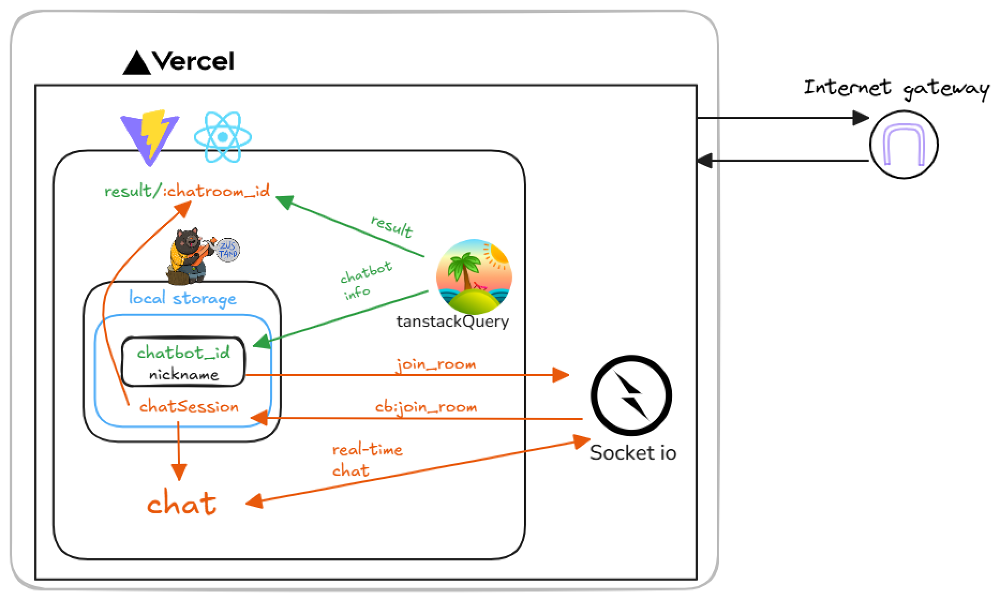

# na-T-na-FE

## 프로젝트 소개

이 프로젝트는 비사이드 포텐데이(AI 해커톤)에서 진행한 NAVER Cloud AI 개발 도구를 활용한 T성향이 ‘티’나는 사람을 위한 F 공감 시뮬레이션 챗봇 서비스.

기획자 1명/디자이너 2명/프론트엔드 개발자 1명/ 백엔드 개발자 1명/ AI개발자 1명이 모여 진행 


## 실행 방법

```sh
$ git clone https://github.com/besides-508-potenday/na-T-na-FE.git
$ npm install
$ npm run dev
```

## 기술 스택

<p>


</p>

## FE 아키텍쳐



## 주요기능

### 유저 닉네임 및 챗봇 전역 상태 관리
- 챗봇정보들을 tanstackQuery를 통해 백엔드에서 부터 수신
- Zustand를 사용하여 유저 닉네임과 선택된 챗봇을 전역 상태로 관리 
- 이를 통해 백엔드로부터 chatroom_id를 발급

### 채팅기능 
- Socket.IO를 통해 chatroom_id로 채팅 방 입장 
- Socket.IO를 통해 실시간으로 5개의 문답을 진행
- 답변에 따라 AI가 거리를 판단하여 하트로 표시
- 부적절한 답변 작성시(욕설등) 경고창 표시시

### 결과 페이지
- 클로바 AI로부터 챗봇(투닥이)과의 거리 판단을 받고 화면에 표시
- 백엔드로부터 받은 mp3 주소를 재생
- 결과 페이지 링크 공유 기능

## 프로젝트 폴더 구조
**src/routes**: 페이지 라우팅을 관리하며, 주요 페이지로는 Home, Chat, Characters, Nickname, Result가 있습니다.

**src/modules**: 각 페이지에서만 사용될 컴포넌트들이나 UI컴포넌트트들을 모아놓았습니다.

**src/components**: 다양한 UI 컴포넌트들이 포함되어 있으며,프로젝트 전반적으로 재사용 가능한 컴포넌트들이 모여 있습니다.

**src/hooks**: 커스텀 훅을 통해 상태 관리 및 비즈니스 로직을 처리합니다.

**src/store**: Zustand를 사용하여 전역 상태를 관리합니다.

**src/lib**: API 호출 및 유틸리티 함수들이 포함되어 있습니다.

**src/assets**: 프로젝트에서 사용된 애니메이션,폰트, svg 형식의 아이콘, svg 그림들이 저장되어잇습니다. 